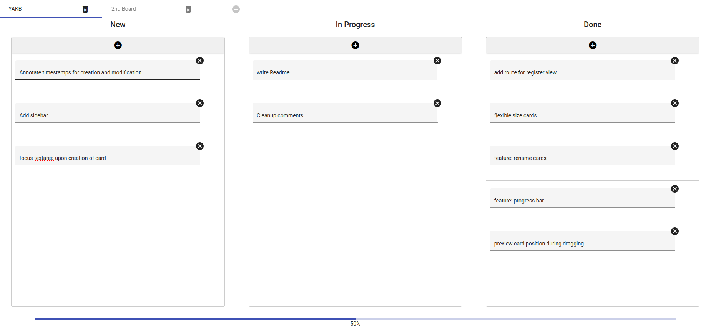

# YAKB: Yet Another Kanban Board
YAKB is a user-friendly Kanban Board WebApp based on the [drag-drop module](https://material.angular.io/cdk/drag-drop/overview) from Angular Materials. The backend is powered by [Fast-API](https://fastapi.tiangolo.com/), utilizing a SQLite database to store your data.

## Purpose and Evolution

Originally, this project was conceived as a personal learning endeavor to gain familiarity with the basic mechanics of the Angular framework. However, as time went on, it evolved into a robust Kanban Board with additional features that set it apart from other apps in this category. Notably, YAKB includes a progress bar, providing a visual representation of your task completion status. Furthermore, it offers direct access to the underlying database, empowering users to derive insightful statistics based on the content and timestamps related to card creation and assignment.

## Main Features

YAKB boasts a range of features to enhance your productivity:

- **Drag'n Drop Mechanics:** Effortlessly organize your tasks and cards by simply dragging and dropping them within the interface.
- **Multiple Boards:** Create and manage multiple boards, enabling you to effectively categorize and handle various projects or workflows.
- **Progress Bar Visualization:** Gain quick insights into task completion progress with the intuitive progress bar visualization.
- **Timestamps and Database Integration:** Timestamps for card assignments to different statuses are automatically stored in the database, enabling comprehensive tracking and analysis.
- **Sign-in/Sign-up Mechanics with JWT Authentication:** Securely create an account, log in, and manage your tasks with the confidence of JWT-based authentication.
- **Fast-API Backend with SQLite Database:** The backend is built using Fast-API and leverages the efficiency and reliability of the SQLite database.

## Installation

Setting up YAKB is a straightforward process:

1. Clone the repository and navigate to its directory.
2. Execute the following command in your terminal or shell:

Shell

`docker-compose up -d`

3. This command will build the Docker images for both the backend and frontend, and then start the containers.
4. Once the setup is complete, access the frontend at [http://localhost:4200](http://localhost:4200) in your web browser.
5. To get started, click on _Sign-up_ and provide your email and a secure password.
6. After logging in, you will be redirected to your personalized dashboard at [http://localhost:4200/profile](http://localhost:4200/profile).
